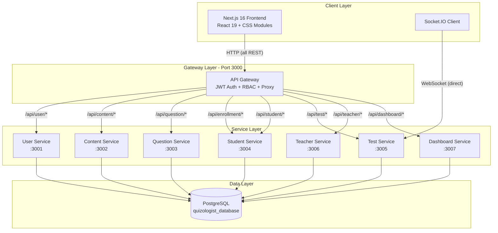
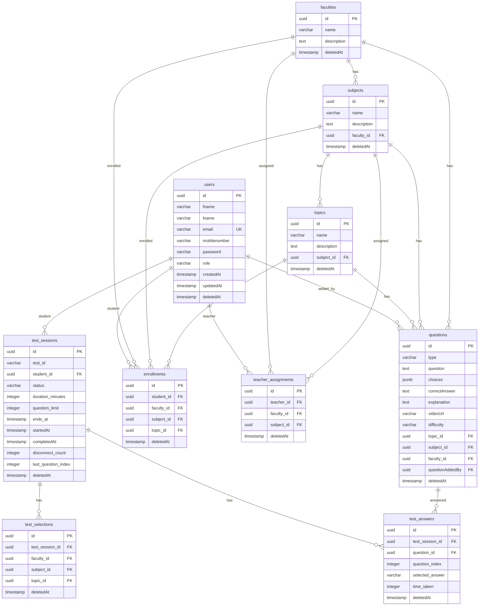
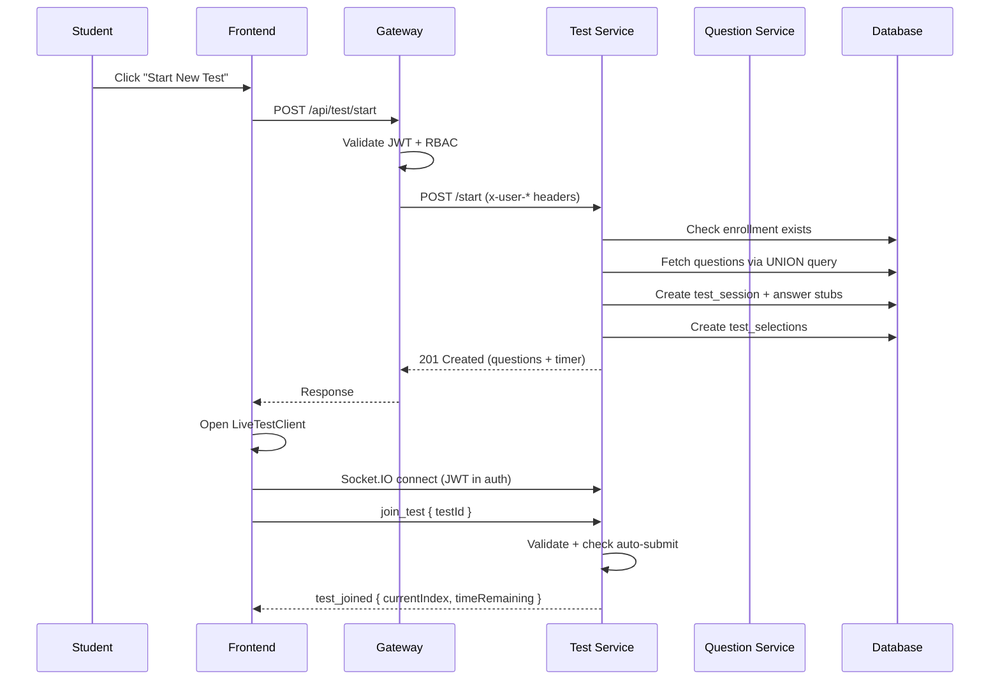
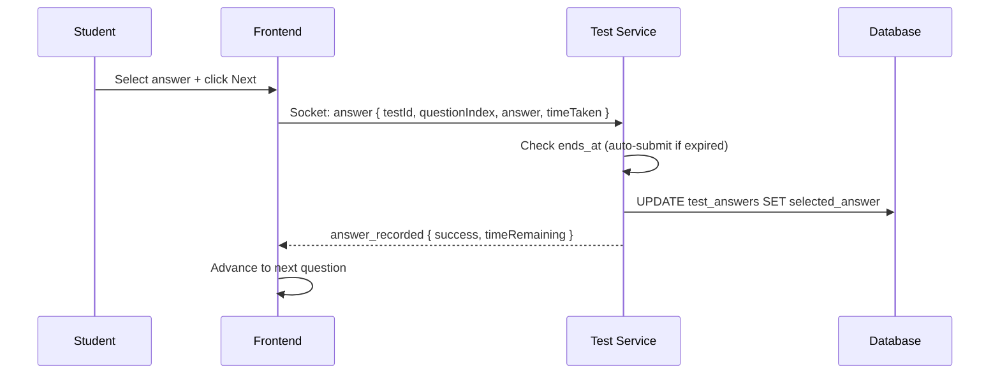
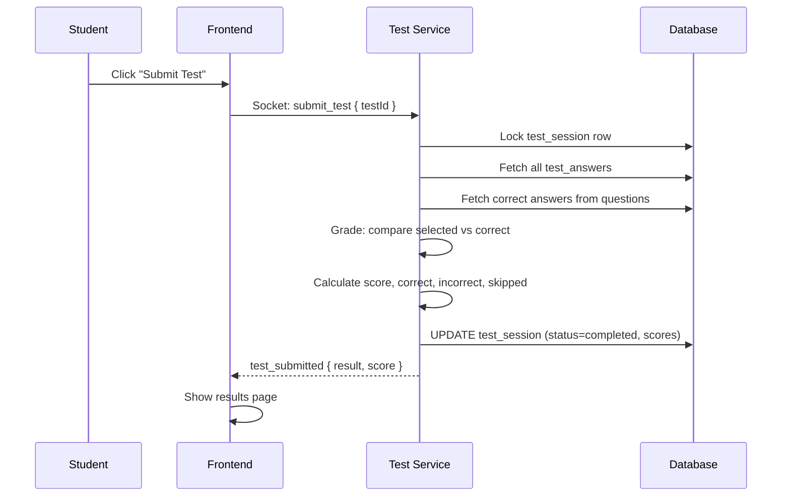
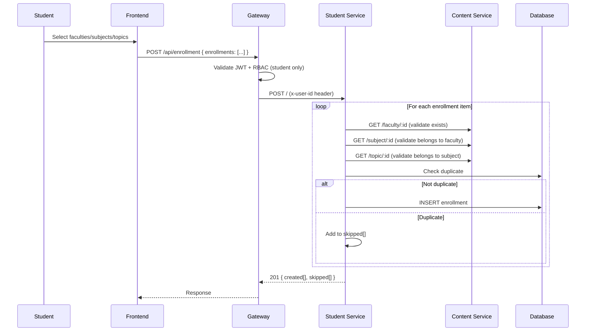
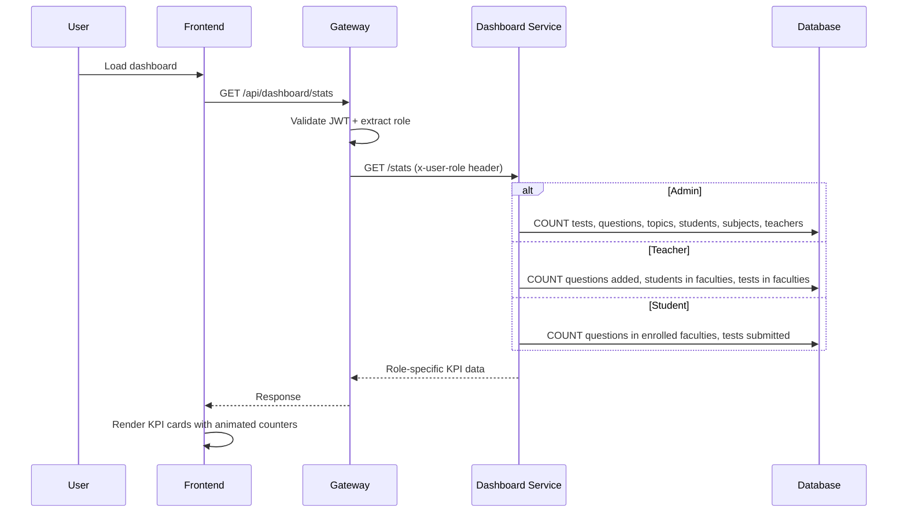

# QuizNew Architecture

> Generated from GitNexus knowledge graph (2,737 nodes, 5,211 edges, 96 clusters, 139 execution flows) and all 8 service API.md files.

## Overview

QuizNew is an educational quiz platform built as a **microservices architecture** with 8 backend services, a Next.js 16 frontend, and a single shared PostgreSQL database. All HTTP traffic flows through an API Gateway that handles authentication and role-based access control. Real-time test-taking uses Socket.IO with a direct connection to the Test Service.

**Tech Stack:**
- **Backend:** Node.js, Express 5, Sequelize v6, PostgreSQL
- **Frontend:** Next.js 16, React 19, CSS Modules, TypeScript
- **Real-time:** Socket.IO (direct to Test Service)
- **Auth:** JWT (7-day expiry)
- **Package manager:** pnpm
- **Validation:** Zod

## Architecture Diagram

## Functional Areas

### 1. API Gateway (`backend/apiGateway/` — Port 3000)

Single entry point for all HTTP requests. Handles:

- **JWT Authentication:** Validates Bearer tokens, extracts `userId`, `email`, `role` into headers
- **RBAC:** Method-based access control. Separate route entries per HTTP method (POST/PUT/DELETE vs GET) enforce write vs read permissions per role
- **Proxy:** Forwards requests to downstream services via `fetch()`, passes user info as `x-user-id`, `x-user-email`, `x-user-role` headers

**Role Permissions:**

| Role | Access |
|------|--------|
| Admin | Full access to all endpoints |
| Teacher | Read content, CRUD questions, view students |
| Student | Read content, read questions, enrollments, take tests |

**Key files:**
- `src/config/routes.ts` — Route-to-service mapping with RBAC rules
- `src/middlewares/auth.middleware.ts` — JWT validation
- `src/middlewares/rbac.middleware.ts` — Role-based access control
- `src/middlewares/proxy.middleware.ts` — Service proxying

### 2. User Service (`backend/userService/` — Port 3001)

Manages user registration, authentication, and user CRUD.

**Endpoints:** `POST /signup`, `POST /login`, `GET /`, `GET /role/:role`, `GET /:id`

**Key patterns:**
- All string fields stored in lowercase (except password)
- Soft-delete restore: on signup with deleted email, restore account
- JWT with 7-day expiry

### 3. Content Service (`backend/contentService/` — Port 3002)

Manages the academic content hierarchy: Faculty → Subject → Topic.

**Endpoints:**
- `/api/content/faculty` — CRUD (admin only for write)
- `/api/content/subject` — CRUD (all roles for read)
- `/api/content/topic` — CRUD (all roles for read)

**Key patterns:**
- Deletion protection: count dependent children before soft-delete
- Nested includes: queries return associated record names (not just IDs)

### 4. Question Service (`backend/questionService/` — Port 3003)

Manages question bank with MCQ and descriptive question types.

**Endpoints:** `POST /`, `GET /`, `GET /search?q=`, `GET /filter`, `GET /topic/:topicId`, `GET /:id`, `PUT /:id`, `DELETE /:id`

**Key patterns:**
- Foreign key validation: `topic_id`, `subject_id`, `faculty_id` must reference active records
- Unique constraint: same question text cannot repeat within same topic
- Difficulty levels: `beginner`, `normal`, `mid`, `hard`, `expert`
- `questionAddedBy` auto-populated from gateway user header

### 5. Student Service (`backend/studentService/` — Port 3004)

Manages student enrollments and student listing.

**Endpoints:**
- `POST /` — Batch enrollment (1-50 items per request)
- `GET /` — Own enrollments (student)
- `GET /student/:studentId` — Student enrollments (admin/teacher)
- `GET /list` — All students with enrollment-based filtering (admin)
- `GET /:studentId/enrollments` — Student detail enrollments (admin)
- `DELETE /:id` — Unenroll

**Key patterns:**
- Batch enrollment with `created[]` and `skipped[]` arrays
- Composite unique index on (student_id, faculty_id, subject_id, topic_id)
- Topic enrollment: enrolling at subject level grants access to ALL topics under it

### 6. Teacher Service (`backend/teacherService/` — Port 3006)

Manages teacher-faculty-subject assignments.

**Endpoints:**
- `GET /list` — Teachers with assignment counts (admin)
- `POST /assign/faculty` — Assign faculty to teacher (admin)
- `POST /assign/subject` — Assign subject to teacher (admin)
- `DELETE /:id` — Remove assignment (admin)
- `GET /` — All assignments with filters (admin)
- `GET /teacher/:teacherId` — Assignments for specific teacher (admin/teacher)

**Key patterns:**
- `teacher_assignments` table: teacher_id (required), faculty_id (required), subject_id (nullable = faculty-only)
- Topics NOT assigned separately — all topics under a subject automatically available
- Raw SQL for aggregation queries (facultyCount, subjectCount, totalAssignments)

### 7. Test Service (`backend/testService/` — Port 3005)

Manages test sessions, real-time test-taking via Socket.IO, and grading.

**REST Endpoints:**
- `POST /start` — Start test with multi-selection
- `POST /submit/:testId` — Submit and grade
- `POST /abandon/:testId` — Abandon test
- `GET /result/:testId` — Full result with answers
- `GET /history` — Own test history (student)
- `GET /student/:studentId` — Student tests (admin/teacher)
- `GET /student/:studentId/performance` — Performance summary
- `GET /detail/:testId` — Full test detail (admin/teacher)
- `GET /all` — All tests with filters (admin)

**Socket.IO Events:**
- Client → Server: `join_test`, `answer`, `skip`, `submit_test`, `heartbeat`
- Server → Client: `test_joined`, `answer_recorded`, `time_update`, `test_submitted`, `error`

**Key patterns:**
- Multi-selection: students select multiple faculties/subjects/topics
- Duration-to-question-limit mapping (15min→15-30, up to 45min→40-120)
- Server-side timer: `ends_at = started_at + duration_minutes`, auto-submit on expiry
- Answer stubs: pre-created with `selected_answer: null` for all questions
- Test ID format: `{firstName}_{lastName}_{dayAbbrev}_{YYYYMMDD}_{HHmmss}`
- Disconnect recovery: increment `disconnect_count`, save `last_question_index`, resume on rejoin
- Heartbeat: 30s interval, 60s timeout

### 8. Dashboard Service (`backend/dashboardService/` — Port 3007)

Provides role-based KPI statistics and student analytics.

**Endpoints:**
- `GET /stats` — Role-based KPI cards (admin: 7 cards, teacher: 4 cards, student: 2 cards)
- `GET /student/topic-performance` — Topic-wise scores (student only)
- `GET /student/subject-performance` — Subject-wise scores
- `GET /student/difficulty-breakdown` — Performance by difficulty
- `GET /student/time-analysis` — Average time per question
- `GET /student/performance-trends` — Test score trends over time
- `GET /student/strengths-weaknesses` — Topic rankings with thresholds (≥80% strong, 50-79% moderate, <50% weak)

**Key patterns:**
- Read-only Sequelize models for TestSession, TestAnswer, Question, Topic, Subject, Faculty
- `timestamps: false` and `paranoid: false` on read-only models
- Minimum 3 attempts required for strength/weakness rankings

## Data Model

## Key Execution Flows

### Flow 1: Student Starts a Test

### Flow 2: Real-time Answer Submission

### Flow 3: Test Submission and Grading

### Flow 4: Batch Enrollment

### Flow 5: Dashboard KPI Stats

## API Route Summary

| Service | Base Path | Key Endpoints | Auth |
|---------|-----------|---------------|------|
| Gateway | `/` | `/health`, `/status`, `/api` | None |
| User | `/api/user` | `/signup`, `/login`, `/`, `/role/:role`, `/:id` | Public / Admin |
| Content | `/api/content` | `/faculty/*`, `/subject/*`, `/topic/*` | Admin write / All read |
| Question | `/api/question` | `/`, `/search`, `/filter`, `/topic/:topicId` | Method-based RBAC |
| Enrollment | `/api/enrollment` | `/`, `/student/:studentId`, `/:id` | Student / Admin |
| Student | `/api/student` | `/list`, `/:studentId/enrollments` | Admin |
| Teacher | `/api/teacher` | `/list`, `/assign/faculty`, `/assign/subject`, `/teacher/:teacherId` | Admin / Teacher |
| Test | `/api/test` | `/start`, `/submit/:testId`, `/abandon/:testId`, `/history`, `/all`, `/result/:testId` | Student / Admin |
| Dashboard | `/api/dashboard` | `/stats`, `/student/topic-performance`, `/student/subject-performance`, etc. | All authenticated |

## Service Communication Patterns

1. **Gateway → Services:** HTTP proxy with `fetch()`, passes `x-user-*` headers
2. **Frontend → Services (REST):** Always through Gateway
3. **Frontend → Test Service (WebSocket):** Direct Socket.IO connection (bypasses Gateway)
4. **Service → Service:** Content Service provides FK validation for Student, Teacher, and Test Services via HTTP
5. **All services → Database:** Direct Sequelize ORM connections to shared `quizologist_database`

## Shared Database Tables

| Table | Owner Service | Used By |
|-------|---------------|---------|
| `users` | User Service | All services (read via raw SQL) |
| `faculties` | Content Service | Content, Student, Teacher, Test, Dashboard |
| `subjects` | Content Service | Content, Student, Teacher, Test, Dashboard |
| `topics` | Content Service | Content, Student, Test, Dashboard |
| `questions` | Question Service | Test, Dashboard |
| `enrollments` | Student Service | Student, Test |
| `teacher_assignments` | Teacher Service | Teacher, Question (seed) |
| `test_sessions` | Test Service | Test, Dashboard |
| `test_selections` | Test Service | Test |
| `test_answers` | Test Service | Test, Dashboard |
