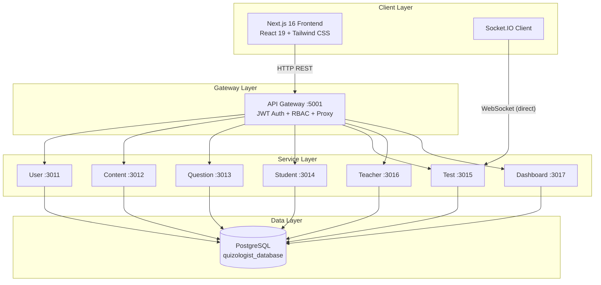

# QuizNew (Quizologist)

> A full-stack educational quiz platform with microservices backend, Next.js frontend, and real-time test taking.

## What is Quizologist?

Quizologist is an online quiz and exam management platform. Students enroll in academic content (faculties → subjects → topics), take timed multiple-choice or descriptive tests, and receive graded results with explanations and performance analytics. Teachers and admins manage content, author questions, assign teaching scopes, and monitor performance.

## System Architecture



### How It Works

1. **Frontend** serves the UI and handles client-side routing, state, and real-time test sessions.
2. **API Gateway** is the single public entry point for all HTTP requests. It validates JWTs, enforces role-based access control (RBAC), and proxies requests to the correct backend service.
3. **Microservices** are independent Node.js/Express services, each owning a specific domain (users, content, questions, tests, etc.).
4. **PostgreSQL** is the shared database. All services connect to the same instance but maintain clear ownership boundaries.
5. **Socket.IO** connects directly from the frontend to the Test Service for real-time test-taking (answers, skips, heartbeats, auto-submit).

## Tech Stack

| Layer | Technology |
|-------|------------|
| Frontend | Next.js 16, React 19, TypeScript, Tailwind CSS 4, shadcn/ui |
| Backend | Node.js, Express 5, TypeScript, Sequelize v6 |
| Database | PostgreSQL 16 |
| Real-time | Socket.IO |
| Auth | JWT (7-day expiry) + bcrypt |
| Validation | Zod |
| Package manager | pnpm |
| Process management | PM2 (production), concurrently (development) |

## Repository Structure

```
QuizNew/
├── frontend/                 # Next.js 16 application
│   ├── app/                  # App Router pages
│   ├── components/           # UI components (shadcn/ui + custom)
│   ├── contexts/             # React contexts (auth, etc.)
│   ├── hooks/                # Custom hooks
│   ├── lib/                  # Utilities and config
│   └── public/               # Static assets
├── backend/                  # Microservices backend
│   ├── apiGateway/           # Single entry point (port 5001 dev / 5001 prod)
│   ├── userService/          # Auth + user CRUD (port 3011)
│   ├── contentService/       # Faculty → Subject → Topic (port 3012)
│   ├── questionService/      # Question bank (port 3013)
│   ├── studentService/       # Enrollments + student directory (port 3014)
│   ├── testService/          # Test lifecycle + Socket.IO (port 3015)
│   ├── teacherService/       # Teacher assignments (port 3016)
│   ├── dashboardService/     # Analytics KPIs (port 3017)
│   └── shared/               # Shared utilities
├── Data/                     # Seed data (JSON)
├── ARCHITECTURE.md           # Detailed architecture docs
├── BACKEND_AUDIT.md          # Backend audit findings
├── NGINX_CONFIG.md           # Nginx deployment guide
└── README.md                 # This file
```

## System Requirements

- Node.js >= 18
- pnpm >= 8
- PostgreSQL 16
- PM2 (optional, for production)

## Quick Start

### 1. Clone and install

```bash
git clone <repository-url>
cd QuizNew
```

### 2. Database setup

```bash
createdb quizologist_database
```

### 3. Backend setup

```bash
cd backend
pnpm install

# Configure each service's .env (see backend/README.md)
cp apiGateway/.env.example apiGateway/.env
cp userService/.env.example userService/.env
# ... repeat for all services

# Run all services
pnpm dev
```

### 4. Frontend setup

```bash
cd frontend
pnpm install
pnpm dev
```

### 5. Access the app

- Frontend: http://localhost:3000
- Backend API: http://localhost:5001 (gateway)
- Socket.IO: ws://localhost:3015 (test service)

## Environment Variables

### Frontend (`frontend/.env`)

```dotenv
NEXT_PUBLIC_APP_NAME=Quizologist
NEXT_PUBLIC_APP_LOGO=/Quizologist.svg
NEXT_PUBLIC_BACKEND_URL=http://localhost:5001
NEXT_PUBLIC_API_URL=http://localhost:5001
```

### Backend (per service `.env`)

```dotenv
PORT=<service port>
NODE_ENV=development
DB_HOST=localhost
DB_PORT=5432
DB_NAME=quizologist_database
DB_USER=postgres
DB_PASSWORD=root
JWT_SECRET=your_jwt_secret_here
JWT_EXPIRES_IN=7d
```

Gateway additionally requires upstream service URLs (`USER_SERVICE_URL`, `CONTENT_SERVICE_URL`, etc.).

## Deployment

### Production Build

```bash
# Backend
cd backend
pnpm build
pnpm run pm2:start

# Frontend
cd frontend
pnpm build
pnpm start
```

### Nginx Reverse Proxy

See [`NGINX_CONFIG.md`](NGINX_CONFIG.md) for SSL termination, rate limiting, and WebSocket proxying configuration.

### PM2 Process Management

```bash
cd backend
pnpm run pm2:start    # Start all services
pnpm run pm2:stop     # Stop all services
pnpm run pm2:restart  # Restart all services
pnpm run pm2:logs     # View logs
```

## Documentation

| Document | Description |
|----------|-------------|
| [`ARCHITECTURE.md`](ARCHITECTURE.md) | Full system architecture, data model, execution flows |
| [`BACKEND_AUDIT.md`](BACKEND_AUDIT.md) | Backend security and code quality audit |
| [`NGINX_CONFIG.md`](NGINX_CONFIG.md) | Nginx deployment and SSL configuration |
| [`frontend/README.md`](frontend/README.md) | Frontend setup, features, and development guide |
| [`backend/README.md`](backend/README.md) | Backend services, API contracts, and microservice details |
| [`apiGateway/API.md`](backend/apiGateway/API.md) | Gateway API contract |
| [`userService/API.md`](backend/userService/API.md) | User service API contract |
| [`contentService/API.md`](backend/contentService/API.md) | Content service API contract |
| [`questionService/API.md`](backend/questionService/API.md) | Question service API contract |
| [`studentService/API.md`](backend/studentService/API.md) | Student service API contract |
| [`testService/API.md`](backend/testService/API.md) | Test service API contract |
| [`teacherService/API.md`](backend/teacherService/API.md) | Teacher service API contract |
| [`dashboardService/API.md`](backend/dashboardService/API.md) | Dashboard service API contract |

## Roles & Permissions

| Capability | Admin | Teacher | Student |
|------------|:-----:|:-------:|:-------:|
| Manage users | ✅ | ❌ | ❌ |
| Manage faculties (write) | ✅ | ❌ | ❌ |
| Read content (subjects/topics) | ✅ | ✅ | ✅ |
| CRUD questions | ✅ | ✅ | ❌ (read only) |
| Enroll / view own enrollments | ❌ | ❌ | ✅ |
| List/inspect all students | ✅ | ❌ | ❌ |
| Assign teachers | ✅ | ❌ | ❌ |
| Start / take tests | ❌ | ❌ | ✅ |
| View any student's test results | ✅ | ✅ | ❌ (own only) |
| View dashboard stats | ✅ | ✅ | ✅ |

## Contributing

1. Follow existing code conventions and patterns.
2. Ensure all services pass linting before committing.
3. Update relevant `API.md` files when changing service contracts.
4. Do not commit secrets or `.env` files.

## License

Proprietary — QuizNew / Quizologist
