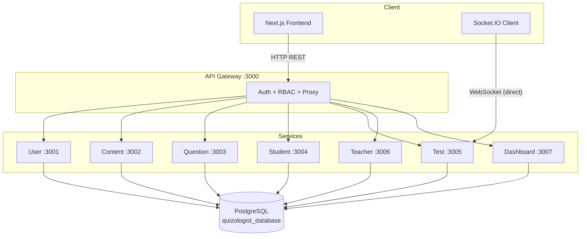

# QuizNew — Backend

> A microservices-based backend for an educational quiz platform (QuizNew / "Quizologist").
> All HTTP traffic is routed through a single **API Gateway**; real-time test-taking uses
> **Socket.IO** with a direct connection to the Test Service.

This README is the **entry point for the backend**. Every service has its own detailed
`API.md` contract, and those are linked throughout this document (see
[API Documentation Index](#api-documentation-index)).

---

## Table of Contents

- [Overview](#overview)
- [Architecture at a Glance](#architecture-at-a-glance)
- [Tech Stack](#tech-stack)
- [Repository Layout](#repository-layout)
- [API Gateway](#api-gateway)
- [Microservices](#microservices)
  - [User Service](#1-user-service-port-3001)
  - [Content Service](#2-content-service-port-3002)
  - [Question Service](#3-question-service-port-3003)
  - [Student Service](#4-student-service-port-3004)
  - [Test Service](#5-test-service-port-3005)
  - [Teacher Service](#6-teacher-service-port-3006)
  - [Dashboard Service](#7-dashboard-service-port-3007)
- [Cross-Cutting Concerns](#cross-cutting-concerns)
  - [Authentication & RBAC](#authentication--rbac)
  - [Response Envelope](#response-envelope)
  - [Data Model](#data-model)
  - [Inter-Service Communication](#inter-service-communication)
  - [Real-Time (Socket.IO)](#real-time-socketio)
  - [Shared Database](#shared-database)
- [Getting Started](#getting-started)
- [API Documentation Index](#api-documentation-index)
- [Known Issues & Audit Notes](#known-issues--audit-notes)
- [Documentation Discrepancies](#documentation-discrepancies)

---

## Overview

QuizNew is an online quiz / exam platform. Students enroll in academic content
(faculties → subjects → topics), take timed multiple-choice or descriptive tests, and
receive graded results with explanations and performance analytics. Teachers and admins
manage content, author questions, assign teaching scopes, and monitor performance.

The backend is built as **8 independent Node.js / Express 5 services** that share a single
PostgreSQL database but are otherwise decoupled. A central API Gateway fans requests out to
the correct service and enforces authentication and role-based access control (RBAC).

### Key design characteristics

- **Gateway pattern** — one public port (`:3000`); internal services are not meant to be
  called directly by clients.
- **Shared database, separate "owners"** — each table has a *owning* service, but several
  services read the same tables (mostly via read-only models / raw SQL).
- **Soft deletes everywhere** — every core entity has a `deleted_at` (Sequelize `paranoid`)
  column; nothing is hard-deleted.
- **JWT auth** — issued at signup/login, 7-day expiry, propagated to downstream services as
  `x-user-*` headers.
- **Real-time testing** — Socket.IO drives the live test session (answers, skips, heartbeat,
  auto-submit on timeout) directly against the Test Service, bypassing the gateway.

---

## Architecture at a Glance



---

## Tech Stack

| Layer | Technology |
|-------|------------|
| Runtime | Node.js (TypeScript, ESM/CJS via `ts-node` / `tsc`) |
| HTTP framework | Express 5 |
| ORM | Sequelize v6 |
| Database | PostgreSQL 16 |
| Real-time | Socket.IO |
| Auth | JSON Web Tokens (`jsonwebtoken`), bcrypt password hashing |
| Validation | Zod |
| Package manager | pnpm (monorepo with `concurrently`) |
| Process runner (dev) | nodemon |

---

## Repository Layout

The backend is a pnpm monorepo. The root `package.json` uses `concurrently` to run all
services at once.

```
backend/
├── package.json            # Root: runs all services together (start / dev / install:all)
├── apiGateway/             # Single entry point — auth, RBAC, proxy
├── userService/            # Auth + user CRUD
├── contentService/         # Faculty → Subject → Topic hierarchy
├── questionService/        # Question bank (MCQ / descriptive)
├── studentService/         # Enrollments + student listing
├── testService/            # Test sessions, grading, Socket.IO
├── teacherService/         # Teacher → faculty/subject assignments
└── dashboardService/       # Role-based KPI + student analytics
```

Each service follows the same internal layout:

```
<service>/
├── package.json
├── tsconfig.json
├── nodemon.json
├── .env / .env.example
├── API.md                  # Per-service API contract
└── src/
    ├── index.ts            # App bootstrap + route mounting
    ├── config/             # env.ts, database.ts, associations.ts
    ├── middlewares/        # auth / gatewayUser, etc.
    ├── modules/<domain>/   # *.model.ts, *.service.ts, *.controller.ts, *.routes.ts, *.validation.ts
    ├── types/index.ts      # Shared types (e.g. AuthRequest)
    ├── utils/              # ApiResponse, ApiError, jwtToken, responseMessages
    └── socket/             # (testService only) Socket.IO server/handlers/session manager
```

### Service ports

| Service | Port | Default base path |
|---------|------|-------------------|
| API Gateway | 3000 | `/api/*` |
| User Service | 3001 | `/api/user` |
| Content Service | 3002 | `/api/content` |
| Question Service | 3003 | `/api/question` |
| Student Service | 3004 | `/api/student`, `/api/enrollment` |
| Test Service | 3005 | `/api/test` (+ Socket.IO on 3005) |
| Teacher Service | 3006 | `/api/teacher` |
| Dashboard Service | 3007 | `/api/dashboard` |

Gateway → service upstream URLs are configured in
[`apiGateway/src/config/env.ts`](apiGateway/src/config/env.ts) (and `.env`).

---

## API Gateway

> Full contract: **[`apiGateway/API.md`](apiGateway/API.md)**

The gateway (`backend/apiGateway/`) is the **only** public entry point. It is a thin
Express app that:

1. **Authenticates** — `middlewares/auth.middleware.ts` validates the `Authorization:
   Bearer <jwt>` header and decodes it into `req.user` (`userId`, `email`, `role`).
2. **Authorizes (RBAC)** — `middlewares/rbac.middleware.ts` enforces per-route roles.
3. **Proxies** — `middlewares/proxy.middleware.ts` forwards the request to the downstream
   service with `fetch()`, forwarding query string + body and injecting the user context as
   headers: `x-user-id`, `x-user-email`, `x-user-role`.

### Routing model

Routes are declared declaratively in [`apiGateway/src/config/routes.ts`](apiGateway/src/config/routes.ts)
as a `RouteConfig[]` array:

```ts
interface RouteConfig {
  path: string;          // Gateway path prefix, e.g. "/question"
  target: string;        // Full upstream URL, e.g. "${USER_SERVICE_URL}/api/question"
  auth: boolean;         // Requires a valid JWT?
  roles?: string[];      // Allowed roles (admin | teacher | student)
  methods?: string[];    // Restrict rule to specific HTTP methods
}
```

A single catch-all (`app.use("/api", ...)`) calls `findMatchingRoute(req.path, req.method)`
to locate the matching rule, then runs `authenticate` → `authorize` → `proxyRequest`.
Because a path can have **multiple entries** (e.g. `POST /question` = admin+teacher,
`GET /question` = all roles), write-vs-read permissions are enforced per HTTP method.

### Gateway utilities / endpoints

| Endpoint | Description |
|----------|-------------|
| `GET /health` | Gateway liveness probe |
| `GET /status` | Serves `public/status.html` |
| `GET /api/internal/status` | Health-checks every downstream service (`/health`); returns `503` if any are down |
| `GET /public/*` | Static assets |

### Error handling

Centralized `ApiError` → `ApiResponse.error` mapping produces consistent JSON:
`400` validation, `401` unauthorized, `403` forbidden, `404` route not found,
`503` service unavailable (proxy failure).

---

## Microservices

### 1. User Service (Port 3001)

> Full contract: **[`userService/API.md`](userService/API.md)**

Owns the `users` table and auth.

**Endpoints**

| Method | Path | Auth | Description |
|--------|------|------|-------------|
| POST | `/api/user/signup` | Public | Register user, returns JWT |
| POST | `/api/user/login` | Public | Authenticate, returns JWT |
| GET | `/api/user` | Admin | List users (paginated) |
| GET | `/api/user/role/:role` | Admin | List users by role |
| GET | `/api/user/:id` | Admin | Get single user |

**Notable behaviour**

- All string fields (except password) are lowercased on storage.
- Signing up with a soft-deleted email **restores** the account.
- Passwords hashed with bcrypt (`BCRYPT_SALT_ROUNDS`, default 10).
- JWT payload: `{ userId, email, role, iat, exp }`; expiry `JWT_EXPIRES_IN` (default `7d`).

### 2. Content Service (Port 3002)

> Full contract: **[`contentService/API.md`](contentService/API.md)**

Owns the **academic hierarchy**: `faculties` → `subjects` → `topics`.

| Resource | Endpoints |
|----------|-----------|
| Faculty | `POST/GET/GET/:id/PUT/DELETE /api/content/faculty` |
| Subject | `POST/GET/GET/faculty/:facultyId/GET/:id/PUT/DELETE /api/content/subject` |
| Topic | `POST/GET/GET/subject/:subjectId/GET/:id/PUT/DELETE /api/content/topic` |

**Notable behaviour**

- Faculty **write** operations are admin-only; reads are available to all authenticated
  roles (enforced at the gateway).
- Nested `include`s return associated names (e.g. a topic response embeds its subject and
  faculty) rather than raw foreign keys.
- Soft-deletes cascade logically (children become inaccessible) rather than physically.

### 3. Question Service (Port 3003)

> Full contract: **[`questionService/API.md`](questionService/API.md)**

Owns the `questions` table. Supports **MCQ** and **descriptive** question types, plus a
`difficulty` level (`beginner`, `normal` (default), `mid`, `hard`, `expert`).

| Method | Path | Auth | Description |
|--------|------|------|-------------|
| POST | `/api/question` | Admin/Teacher | Create question (`questionAddedBy` auto-set from header) |
| GET | `/api/question` | All | List (paginated) |
| GET | `/api/question/search?q=` | All | Case-insensitive search (PostgreSQL `ILIKE`) |
| GET | `/api/question/topic/:topicId` | All | Questions in a topic |
| GET | `/api/question/:id` | All | Single question |
| PUT | `/api/question/:id` | Admin/Teacher | Partial update |
| DELETE | `/api/question/:id` | Admin/Teacher | Soft delete |

**Notable behaviour**

- `topic_id`, `subject_id`, `faculty_id` must reference active (non-deleted) records.
- Unique question text per topic.
- MCQ requires 2–5 `choices`; `correctAnswer` must match one of them; descriptive questions
  must not carry `choices`.

### 4. Student Service (Port 3004)

> Full contract: **[`studentService/API.md`](studentService/API.md)**

Owns the `enrollments` table and the admin student directory.

| Method | Path | Auth | Description |
|--------|------|------|-------------|
| POST | `/api/enrollment` | Student | Batch enroll (1–50 items) |
| GET | `/api/enrollment` | Student | Own enrollments |
| GET | `/api/enrollment/student/:studentId` | Admin/Teacher | A student's enrollments |
| GET | `/api/enrollment/:id` | — | Single enrollment |
| DELETE | `/api/enrollment/:id` | Student | Unenroll (soft) |
| GET | `/api/student/list` | Admin | All students (filter by faculty/subject/topic) |
| GET | `/api/student/:studentId/enrollments` | Admin | Student detail + enrollments |

**Notable behaviour**

- Batch create returns `{ created[], skipped[], totalCreated, totalSkipped }` — duplicates
  are skipped rather than erroring.
- Enrollment integrity: `subject_id` must belong to `faculty_id`, `topic_id` must belong to
  `subject_id`, and a `subject_id` is required when a `topic_id` is supplied.
- Composite unique index `(student_id, faculty_id, subject_id, topic_id)` prevents
  duplicates.

### 5. Test Service (Port 3005)

> Full contract: **[`testService/API.md`](testService/API.md)** ·
> Implementation plan: **[`testService/PLAN.md`](testService/PLAN.md)**

Owns `test_sessions`, `test_selections`, `test_answers`. Manages the **entire test
lifecycle** — creation, real-time session, grading, and history.

**REST endpoints**

| Method | Path | Auth | Description |
|--------|------|------|-------------|
| POST | `/api/test/start` | Student | Start session (multi-selection) |
| POST | `/api/test/submit/:testId` | Student | Submit + grade (REST) |
| POST | `/api/test/abandon/:testId` | Student | Abandon session |
| GET | `/api/test/history` | Student | Own history |
| GET | `/api/test/result/:testId` | Student | Full result (post-completion) |
| GET | `/api/test/:testId` | Student | Session detail |
| GET | `/api/test/student/:studentId` | Admin/Teacher | A student's tests |
| GET | `/api/test/student/:studentId/results` | All* | Full breakdown |
| GET | `/api/test/student/:studentId/summary` | All* | Lightweight summary |
| GET | `/api/test/student/:studentId/performance` | Admin/Teacher | Performance rollup |
| GET | `/api/test/detail/:testId` | Admin/Teacher | Full test detail |
| GET | `/api/test/all` | Admin | All tests (filters) |

\* Students may only view their own data; admin/teacher may view any.

**Validation & rules**

- Duration → question-limit map: 15m (15–30), 20m (20–40), 25m (25–50), 30m (30–60),
  40m (30–80), 45m (40–120).
- One active test per student; 5-minute cooldown between creations.
- Server-side timer: `ends_at = started_at + duration`; auto-submit on expiry (and on
  reconnect/heartbeat timeout).
- Tests older than 24h are auto-abandoned.
- Score = `(correct / total_questions) * 100`.

### 6. Teacher Service (Port 3006)

> Full contract: **[`teacherService/API.md`](teacherService/API.md)**

Owns `teacher_assignments` (teacher → faculty, optionally faculty → subject). Topics are
**never** assigned separately — any subject under an assigned faculty is fully accessible.

| Method | Path | Auth | Description |
|--------|------|------|-------------|
| GET | `/api/teacher/list` | Admin | Teachers + assignment counts |
| POST | `/api/teacher/assign/faculty` | Admin | Assign faculty |
| POST | `/api/teacher/assign/subject` | Admin | Assign subject (must belong to assigned faculty) |
| DELETE | `/api/teacher/:id` | Admin | Remove assignment |
| GET | `/api/teacher` | Admin | All assignments (filters) |
| GET | `/api/teacher/teacher/:teacherId` | Admin/Teacher | One teacher's assignments |

**Notable behaviour**

- Aggregation counts (`facultyCount`, `subjectCount`, `totalAssignments`) use raw SQL.
- Subject assignment must reference a subject that belongs to an already-assigned faculty.

### 7. Dashboard Service (Port 3007)

> Full contract: **[`dashboardService/API.md`](dashboardService/API.md)**

Read-only analytics. Returns **role-specific KPIs** from a single `/api/dashboard/stats`
endpoint:

| Role | KPIs |
|------|------|
| Admin | `testsSubmitted`, `totalQuestions`, `totalTopics`, `topicsCovered`, `studentsCount`, `totalSubjects`, `totalTeachers` |
| Teacher | `questionsAdded`, `studentsInFaculties`, `testsSubmitted`, `questionsInFaculties` |
| Student | `questionsInEnrolledFaculties`, `testsSubmitted` |

Stat queries use raw SQL against the shared DB (read-only models, `timestamps: false`,
`paranoid: false`). In addition to `/stats`, the service also exposes **student analytics**
endpoints (see [Documentation Discrepancies](#documentation-discrepancies)).

---

## Cross-Cutting Concerns

### Authentication & RBAC

- Tokens are issued by User Service (`/signup`, `/login`) and verified by the gateway.
- The gateway injects `x-user-id`, `x-user-email`, `x-user-role` into every proxied request
  so downstream services can trust the caller without re-verifying the JWT.
- Services also accept `gatewayUser.middleware` (e.g. test/question/content) for cases where
  the header is the source of truth.
- Roles: **admin**, **teacher**, **student**. Permission matrix (enforced at the gateway via
  `routes.ts`):

| Capability | admin | teacher | student |
|------------|:-----:|:-------:|:-------:|
| Manage users | ✅ | ❌ | ❌ |
| Manage faculties (write) | ✅ | ❌ | ❌ |
| Read content (subjects/topics) | ✅ | ✅ | ✅ |
| CRUD questions | ✅ | ✅ | ❌ (read only) |
| Enroll / view own enrollments | ❌ | ❌ | ✅ |
| List/inspect all students | ✅ | ❌ | ❌ |
| Assign teachers | ✅ | ❌ | ❌ |
| Start / take tests | ❌ | ❌ | ✅ |
| View any student's test results | ✅ | ✅ | ❌ (own only) |
| View dashboard stats | ✅ | ✅ | ✅ |

### Response Envelope

Every service returns a consistent shape:

```json
{ "success": true, "message": "…", "data": { } }
```

Errors set `"success": false` with a `null` `data` and an appropriate HTTP status. Shared
helpers live in `utils/ApiResponse.ts` and `utils/ApiError.ts` (replicated per service).

### Data Model

A single PostgreSQL database (`quizologist_database`) is shared by all services. Each table
has one owning service; others read it.

| Table | Owner | Purpose |
|-------|-------|---------|
| `users` | User Service | Accounts (role: admin/teacher/student) |
| `faculties` | Content Service | Top of content hierarchy |
| `subjects` | Content Service | Belong to a faculty |
| `topics` | Content Service | Belong to a subject |
| `questions` | Question Service | MCQ / descriptive bank |
| `enrollments` | Student Service | Student ↔ content scope |
| `teacher_assignments` | Teacher Service | Teacher ↔ faculty/subject |
| `test_sessions` | Test Service | A single test attempt |
| `test_selections` | Test Service | Content scope chosen for a test |
| `test_answers` | Test Service | Per-question answer record |

### Inter-Service Communication

1. **Client → Gateway → Service** — all REST calls go through the gateway proxy.
2. **Service → Content Service** — Student / Teacher / Test services call Content Service
   over HTTP to validate foreign keys (faculty/subject/topic existence & ownership).
3. **Service → Database** — every service opens its own Sequelize connection to the shared DB
   (read-only models for cross-service reads).
4. **Client → Test Service (WebSocket)** — Socket.IO connects **directly** to `:3005`,
   bypassing the gateway, using the JWT for auth.

### Real-Time (Socket.IO)

The Test Service attaches a Socket.IO server and authenticated handlers
(`src/socket/socketServer.ts`, `socketHandler.ts`, `sessionManager.ts`).

| Direction | Event | Payload |
|-----------|-------|---------|
| C→S | `join_test` | `{ testId }` |
| C→S | `answer` | `{ testId, questionIndex, questionId, answer, timeTaken }` |
| C→S | `skip` | `{ testId, questionIndex, questionId, timeTaken }` |
| C→S | `submit_test` | `{ testId }` |
| C→S | `heartbeat` | `{ testId, questionIndex }` |
| S→C | `test_joined` | `{ testId, totalQuestions, currentIndex, timeRemaining, endsAt }` |
| S→C | `answer_recorded` | `{ testId, questionIndex, success, timeRemaining }` |
| S→C | `time_update` | `{ timeRemaining }` |
| S→C | `test_submitted` | `{ testId, result, reason? }` (`reason: "timeout"` on expiry) |
| S→C | `error` | `{ message }` |

**Resilience:** disconnects increment `disconnect_count` and persist `last_question_index`;
rejoining resumes from that index. Heartbeats are sent every 30s; a 60s gap abandons the
session. Expired sessions auto-submit.

### Shared Database

All services point at the same PostgreSQL instance (config in each `src/config/env.ts` and
`.env`). Sequelize `paranoid: true` (soft deletes) is the norm; Dashboard / Test services
use `timestamps: false` read-only models for analytics. On first run, `DB_ALTER_TABLES` /
`DB_DROP_TABLES` env flags control schema syncing.

---

## Getting Started

### Prerequisites

- Node.js (LTS) + pnpm
- PostgreSQL 16 (database `quizologist_database`)
- Optional seed data: `backend/Data/FacultyData.json`, `backend/Data/Questions.json`

### Install

From the backend root, install every workspace:

```bash
pnpm install            # or: pnpm run install:all
```

### Environment

Each service needs a `.env`. Copy the examples and set at minimum:

```dotenv
# common
PORT=<service port>
NODE_ENV=development
DB_HOST=localhost
DB_PORT=5432
DB_NAME=quizologist_database
DB_USER=postgres
DB_PASSWORD=root
JWT_SECRET=your_jwt_secret_here
JWT_EXPIRES_IN=7d
```

For the gateway, set the upstream URLs (`USER_SERVICE_URL`, `CONTENT_SERVICE_URL`, …) — see
[`apiGateway/.env.example`](apiGateway/.env.example).

### Run (all services)

```bash
pnpm start     # production build + run (concurrently)
pnpm dev       # ts-node + nodemon watch mode
```

The gateway listens on `:3000`; individual services on `:3001`–`:3007`.

### Health checks

```bash
curl http://localhost:3000/health                    # gateway
curl http://localhost:3000/api/internal/status       # all downstream services
curl http://localhost:3001/health                     # a single service
```

### Seeding

Several services ship seed scripts:

- `userService/src/config/seed.ts` — initial users
- `questionService/src/seed/importQuestions.ts` — import from `Data/Questions.json`
- `contentService/src/seed/importFacultyData.ts` — import from `Data/FacultyData.json`
- `teacherService/src/seed/randomTeacherAssignments.ts` — demo teacher assignments

---

## API Documentation Index

The authoritative, request/response-level contract for every service lives in its `API.md`.
Always refer to these for field requirements, status codes, and examples:

| Service | API Documentation | Base URL (gateway) |
|---------|-------------------|--------------------|
| API Gateway | [apiGateway/API.md](apiGateway/API.md) | `http://localhost:3000` |
| User Service | [userService/API.md](userService/API.md) | `http://localhost:3000/api/user` |
| Content Service | [contentService/API.md](contentService/API.md) | `http://localhost:3000/api/content` |
| Question Service | [questionService/API.md](questionService/API.md) | `http://localhost:3000/api/question` |
| Student Service | [studentService/API.md](studentService/API.md) | `http://localhost:3000/api/student`, `/api/enrollment` |
| Test Service | [testService/API.md](testService/API.md) · [PLAN.md](testService/PLAN.md) | `http://localhost:3000/api/test` |
| Teacher Service | [teacherService/API.md](teacherService/API.md) | `http://localhost:3000/api/teacher` |
| Dashboard Service | [dashboardService/API.md](dashboardService/API.md) | `http://localhost:3000/api/dashboard` |

---

## Known Issues & Audit Notes

From [`BACKEND_AUDIT.md`](../BACKEND_AUDIT.md) (audit date 2026-07-10):

- **Raw SQL in Student Service** — `studentService/src/modules/student/student.service.ts`
  builds SQL strings manually for the filtered student list. Recommendation: migrate to
  Sequelize `findAndCountAll` + `include` for consistency and safety.
- **Documentation gaps (at audit time)** — `studentService/API.md` and `apiGateway/API.md`
  were missing the `/student/list` (and related enrollment) endpoints. These have since been
  documented (see linked `API.md` files above).

The platform-wide design is described in [`ARCHITECTURE.md`](../ARCHITECTURE.md).

---

## Documentation Discrepancies

While analyzing the code, the following differences between the written `API.md` contracts
and the actual implementation were found. They are noted here so consumers are not
misled:

1. **Dashboard Service student analytics are not in `dashboardService/API.md`.**
   `dashboardService/src/modules/dashboard/dashboard.routes.ts` registers six additional
   endpoints beyond the documented `/stats`:

   | Method | Path | Description |
   |--------|------|-------------|
   | GET | `/api/dashboard/student/topic-performance` | Topic-wise scores |
   | GET | `/api/dashboard/student/subject-performance` | Subject-wise scores |
   | GET | `/api/dashboard/student/difficulty-breakdown` | Performance by difficulty |
   | GET | `/api/dashboard/student/time-analysis` | Avg time per question |
   | GET | `/api/dashboard/student/performance-trends` | Score trend over time |
   | GET | `/api/dashboard/student/strengths-weaknesses` | Strength/weakness ranking (≥80% strong, 50–79% moderate, <50% weak; min 3 attempts) |

   These are **student-only** and are mentioned in `ARCHITECTURE.md` but absent from the
   service `API.md`. They should be added to `dashboardService/API.md`.

2. **Gateway RBAC is method-granular.** A single path (e.g. `/question`) has separate route
   entries for `POST`/`PUT`/`DELETE` (admin+teacher) vs `GET` (all roles). Consumers building
   clients should treat read vs write permissions independently per endpoint.

3. **`questionAddedBy` provenance.** Question Service derives the author from the
   `x-user-id` gateway header, not from the request body — the gateway is the trust boundary.
